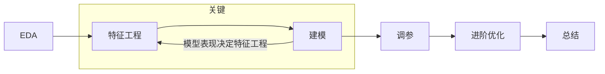

# 招商银行Fintech

### 目录


## 一赛题描述


## 二 方案介绍



### 1 EDA探索性数据处理

1. 检查label分布,是否平衡[ ]

2. 数据字段类型 df.info() [x]

3. 数据字段分布 df.describe() 主要检查异常值和缺失值[ ],考虑每个字段的意义从而进行判断

   将缺失值可以全部替换成np.nan,dtype==float[ ]

4. 训练集和测试集字段分布的差异,可以用取log来使得差异变小[ ] 

5. 训练集和测试集label分布的差异 对于不平衡的label可以改变权重或者使用过采样[ ]

## 2 数据预处理


1. 对于标签类字段

```python
from sklearn.preprocessing import LabelEncoder
enc = LabelEncoder()
data=['小猫','小猫','小狗','小狗','兔子','兔子']
enc=enc.fit(['小猫','小狗','兔子']) #可以使用重复的数,没必要去重
data=enc.transform(data)
```

2. 缺失值

3. 如果存在时间类的变量,提取出年月日小时星期是否为周末等字段


## 3 特征工程

1. **对金额进行挖掘**

* 总金额的log值
* <u>交易金额的小数部分</u>

2. **对时间挖掘**

* 计算3/7/30/60天的最大金额/最小金额/**<u>平均</u>**/**<u>标准差</u>**/交易次数/总金额/总收入/收入次数/总支出/支出次数/**<u>聚集度特征</u>**

3. **对交易类型进行挖掘**

* 交易方向
* 支付方式  <u>借记卡信用卡有关的信息</u>
* 收支一级代码 

4. **从业务角度出发建立特征** *

* RFM模型
  * 粗粒度刻画：每个id最后一次交易时间、最后一次交易时间是否晚于平均值、交易总次数、多少天有交易行为、交易的总金额、平均每天交易次数、平均每天交易金额、平均每次交易金额；
  * 进一步细粒度刻画：按照不同交易方向，不同交易方式，以及不同的一级二级交易分类分别聚合分组，计算每个id的最后一次交易时间、最后一次交易时间是否晚于平均值、交易总次数、平均每天交易次数、总金额数、平均每天金额、平均每次金额；
  * 再进一步细粒度：trd中包含5月和6月两个月用户交易行为，单独考虑信贷用户每月的行为还是很重要的，所以分别对每个月做1) 2)中所述特征统计。
* word2vec

5. 找毒特???

* 找到测试集和训练集分布不一样的特征然后删除

<!--对特征工程的一些感悟:-->

<!--根据5W1H进行聚合来刻画用户画像,比如说对WHEN进行聚合,每个星期的WHO,WHERE,WHAT,WHY,HOW作为特征/或者对于HOW进行聚合,通过每种方式的WHO,WHAT,WHEN,WHERE,WAY.-->

<!--还可以多种关键词进行聚合,比如WHEN,HOW聚合,每个星期通过这种方法的WHO,WHAT,WHERE,WHY-->

<!--这些都是难以用机器学习完成的工作.-->

* 针对cate类
  * cate类交叉，num类分桶(等频、等宽、卡方)
  * 重要的cate类特征做count和转化率特征（注意不要标签泄露）
  * cate类特征计算评分卡模型中的WOE值，num类卡方分箱后计算WOE


​	


## 4 建模

XGBoost

注意要画出每个特征的feature_importances_


## 5 调参

### 5.1 人工调参

### 5.2 随机搜索

### 5.3 网格搜索

### 5.4 贝叶斯调参(需要学习)

## 6 进阶优化

### 6.1 模型集成

最终使用stacking融合方式，将lightgbm和xgboost的预测结果作为特征，与tag的原始字段一同输入另一个lightgbm模型，使用十折交叉验证得到最终结果。

### 6.2 伪标签(不是很懂)

```python
n_cv = 5
kf = StratifiedKFold(n_splits=n_cv, shuffle=True, random_state=666)
for train_index, test_index in kf.split(x, y):
    print('*********************')
    train, valid = train_tag.iloc[train_index], train_tag.iloc[test_index]
    # psudo中存储的是评测集的数据，其标签是预测的，并不是真正的标签
    train = train.append(psudo[train.columns], ignore_index=True)
    train[cat] = train[cat].astype('category')
    
    lgb_train = lgb.Dataset(train[x_col], train['flag'])
    lgb_eval = lgb.Dataset(valid[x_col], valid['flag'], reference=lgb_train)
    clf = lgb.train(params, lgb_train, 2000, valid_sets = [lgb_train,lgb_eval], verbose_eval=100, early_stopping_rounds=100,
                    categorical_feature=cat)
 
    clf.predict(valid[x_col],num_iteration=clf.best_iteration)
    
    train_model_pred[test_index] = clf.predict(valid[x_col],num_iteration=clf.best_iteration)
    test_model_pred += clf.predict(test_tag[x_col],num_iteration=clf.best_iteration)
train_tag['preds'] = train_model_pred
test_tag['preds'] = test_model_pred/n_cv
```

## 7 总结

* 中心还是要放在特征工程上面,学习到一波关于违约的"强特" :<u>金额的平均值/标准差/最后一次交易有关的特征/按天统计的特征/对于类别特征还可以统计比例</u>

* 强特之间还可以做交叉,目的使用户之间的差距增大.

* 多学习一些刻画用户画像的模型,如RFM <u>RFM模型是衡量客户价值和客户创利能力的重要工具和手段，客户主要包含三个重要属性：最近一次消费 (Recency)， 消费频率 (Frequency)， 消费金额 (Monetary)。</u>

  


